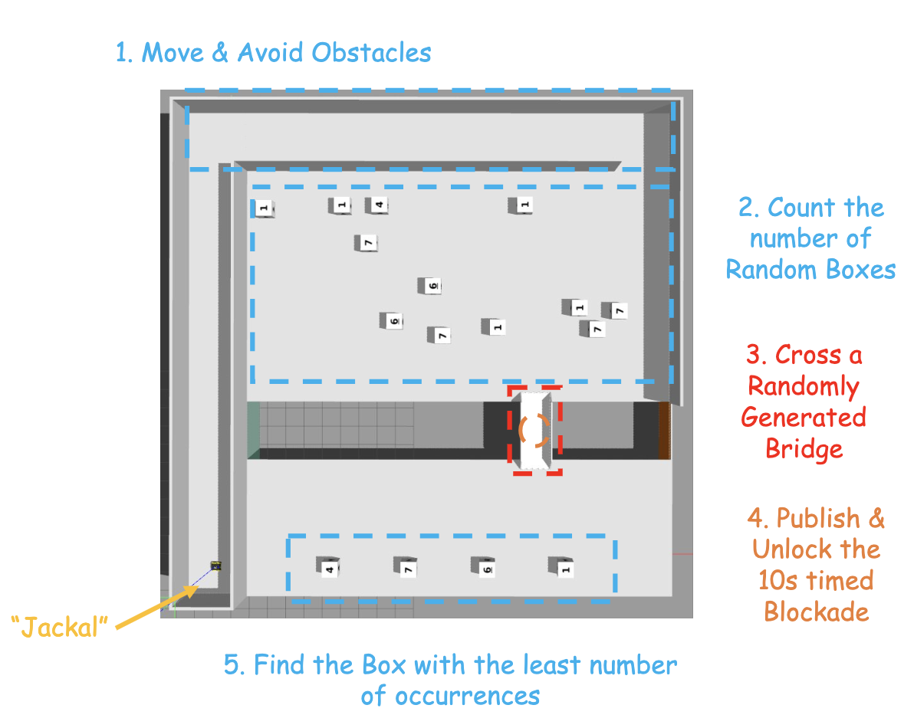
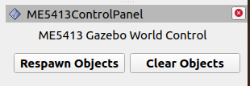

# ME5413_Final_Project_Group9

NUS ME5413 Autonomous Mobile Robotics Final Project

> Authors: Group9




## Dependencies

* System Requirements:
  * Ubuntu 20.04 (18.04 not yet tested)
  * ROS Noetic (Melodic not yet tested)
  * C++11 and above
  * CMake: 3.0.2 and above
* This repo depends on the following standard ROS pkgs:
  * `roscpp`
  * `rospy`
  * `rviz`
  * `std_msgs`
  * `nav_msgs`
  * `geometry_msgs`
  * `visualization_msgs`
  * `tf2`
  * `tf2_ros`
  * `tf2_geometry_msgs`
  * `pluginlib`
  * `map_server`
  * `gazebo_ros`
  * `jsk_rviz_plugins`
  * `jackal_gazebo`
  * `jackal_navigation`
  * `velodyne_simulator`
  * `teleop_twist_keyboard`
  * `teleop_twist_joystick`
* And this [gazebo_model](https://github.com/osrf/gazebo_models) repositiory

## Important Note Before Your Coding !!!

- **Unless you find significant bug in the main or master branch, do not push to them, please checkout you own branch, like dev-lx.**
- **Do not upload any large files(Not including your code). If necessary, please upload to your GoogleDrive or OneDrive and update README.**
- **Updata your Notion Page in time.**

## Installation

This repo is a ros workspace, containing three rospkgs:

* `interactive_tools` are customized tools to interact with gazebo and your robot
* `jackal_description` contains the modified jackal robot model descriptions
* `me5413_world` the main pkg containing the gazebo world, and the launch files

**Note:** If you are working on this project, it is encouraged to fork this repository and work on your own fork!

After forking this repo to your own github:

**Using [Clion](https://www.jetbrains.com/clion/) would be better**

```bash
# Clone your own fork of this repo (assuming home here `~/`)
cd
https://github.com/ME5413-Group9-2025/ME5413_Final_Project.git
cd ME5413_Final_Project
rm -rf .git # After this step, any updates from TA will conduct by yourself manually

# Clone the necessary repository
cd src
git clone https://github.com/ME5413-Group9-2025/navigation
git clone https://github.com/ME5413-Group9-2025/robot_localization.git --branch noetic-devel
git clone https://github.com/ME5413-Group9-2025/teb_local_planner.git
git clone https://github.com/ME5413-Group9-2025/explore_lite.git
git clone https://github.com/ME5413-Group9-2025/me5413_bringup.git
git clone https://github.com/ME5413-Group9-2025/me5413_perception.git

# clone any other code in our github team and cartographer

# Install all dependencies
cd ..
rosdep install --from-paths src --ignore-src -r -y

# Build
rm -rf build build_isolated install install_isolated devel devel_isolated
catkin_make_isolated
# only make specified package
catkin_make_isolated --pkg <pkg_name> --use-ninja

# Source 
source devel_isolated/setup.bash
```

To properly load the gazebo world, you will need to have the necessary model files in the `~/.gazebo/models/` directory.

There are two sources of models needed:

* [Gazebo official models](https://github.com/osrf/gazebo_models)

  ```bash
  # Create the destination directory
  cd
  mkdir -p .gazebo/models
  
  # Clone the official gazebo models repo (assuming home here `~/`)
  git clone https://github.com/osrf/gazebo_models.git
  
  # Copy the models into the `~/.gazebo/models` directory
  cp -r ~/gazebo_models/* ~/.gazebo/models
  ```

* [Our customized models](https://github.com/NUS-Advanced-Robotics-Centre/ME5413_Final_Project/tree/main/src/me5413_world/models)

  ```bash
  # Copy the customized models into the `~/.gazebo/models` directory
  cp -r ~/ME5413_Final_Project/src/me5413_world/models/* ~/.gazebo/models
  ```

## Usage

### 0. Gazebo World

This command will launch the gazebo with the project world

```bash
# Launch Gazebo World together with our robot, you can change any sensor you want in this shell
roscd me5413_bringup/shell
sh start.sh
```

Here, manual teleoperation is automatically load, default input is Xbox joystick .

### 1. Mapping

After launching **Step 0**, in the second terminal:

```bash
# Launch GMapping, No only support GMapping, Google Catographer on the way
roslaunch me5413_bringup mapping.launch
```

After finishing mapping, run the following command in the thrid terminal to save the map:

```bash
# Save the map as `my_map` in the `maps/` folder
roscd me5413_bringup/maps/
rosrun map_server map_saver -f my_map map:=/map
```


### 2. Navigation

Once completed **Step 1** mapping and saved your map, quit the mapping process.

Then, in the second terminal:

```bash
# Load a map, launch AMCL localizer, start navigation
roslaunch me5413_bringup bringup.launch
```


## Student Tasks

### 1. Map the environment

* You may use any SLAM algorithm you like, any type:
  * 2D LiDAR
  * 3D LiDAR
  * Vision
  * Multi-sensor
* Verify your SLAM accuracy by comparing your odometry with the published `/gazebo/ground_truth/state` topic (`nav_msgs::Odometry`), which contains the gournd truth odometry of the robot.
* You may want to use tools like [EVO](https://github.com/MichaelGrupp/evo) to quantitatively evaluate the performance of your SLAM algorithm.

### 2. Using your own map, navigate your robot

* We have provided you a GUI in RVIZ that allows you to click and generate/clear the random objects in the gazebo world:

  

* From the starting point, move to one of the four given destination boxes at the end of the map:

  * Count the number of occurance of each type of box (e.g. box 1, 2, 3, 4, the box numbers are randomly generated)
  * Cross the bridge (the location of the bridge is randomly generated)
  * Unlock the blockade on the bridge by publishing a `true` message (`std_msgs/Bool`) to the `/cmd_open_bridge` topic
  * Dock at the destination box with the least number of occurance

## Contribution

You are welcome contributing to this repo by opening a pull-request

We are following:

* [Google C++ Style Guide](https://google.github.io/styleguide/cppguide.html),
* [C++ Core Guidelines](https://isocpp.github.io/CppCoreGuidelines/CppCoreGuidelines#main),
* [ROS C++ Style Guide](http://wiki.ros.org/CppStyleGuide)

## License

The [ME5413_Final_Project](https://github.com/NUS-Advanced-Robotics-Centre/ME5413_Final_Project) is released under the [MIT License](https://github.com/NUS-Advanced-Robotics-Centre/ME5413_Final_Project/blob/main/LICENSE)
